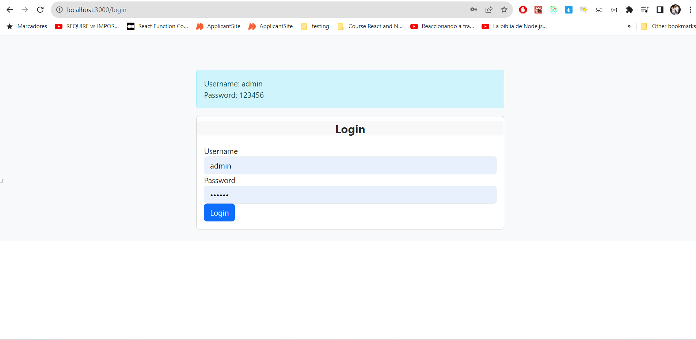

INSTRUCCIONES  PARA CORRER LA APP TODO:

Herramientas:
Base de datos: MySQL Server 8.0
Node: v16.17.1

Pasos para subir el proyecto:
instalar MySQL Server 8.0 : poner las credenciales en el backend. en el archivo env.
nota: el backend crea automaticamente la base de datos y las tablas.

Instalar dependencias 
-->backend: npm install
-->frontend: npm install

para subir el  backend correr este comando:
npm run dev
npm run ts

para subir  frontend  correr este comando:
npm run start

##### **Images** 

##### **Images** 

##### **Images** 

##### **Images** 

